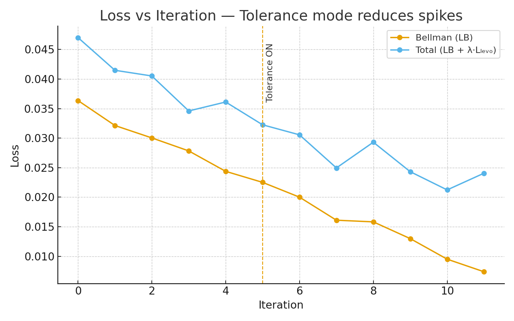

# Levo Lives in Bellman — Paradox‑Aware Tolerance

Zero‑order training loop with "AdamW → Lion" schedule and a "conditional tolerance mode (Levo)" that only activates under high uncertainty (`τ_on=0.95`, `τ_off=0.952`). The goal is not perfection, but "tolerance": fewer loss spikes and more stable outputs on ambiguous prompts.

### What’s inside
- `LevoLivesInBellmanGit.ipynb`: runnable demo (Torch).  
- Levo "gating" with hysteresis + kNN fallback.  
- Metrics: cosine before/after, coverage in tolerance band, AE eval cost.
- Plot: resonance (cos) before vs after.

## Quick start
1. Environment
   ```bash
   # create env (optional)
   python -m venv .venv && source .venv/bin/activate  # Windows: .venv\Scripts\activate
   pip install -U pip
   pip install torch torchvision torchaudio --index-url https://download.pytorch.org/whl/cu121  
   # or 'cpu' wheels
   pip install lion-pytorch numpy pandas scikit-learn matplotlib
   ```
2. Run
   - Open the notebook: `LevoLivesInBellmanGit.ipynb`
   - Run cells top→bottom. If `lion-pytorch` isn’t installed, the loop falls back to AdamW automatically.
   - [, (https://colab.research.google.com/github/Jaime2pb3/Levo-lives-in-Bellman/blob/main/LevoLivesInBellmanGit.ipynb)]


Two loss curves (Bellman and Total). After “Tolerance ON”, the total loss shows fewer spikes and smoother decay.

## Files
- `README.md`
- `requirements.txt` 
- `.gitignore` 
- `LevoLivesInBellmanGit.ipynb` 

## Notes
- Tolerance Mode (Levo): Triggered only if resonance/uncertainty exceeds the threshold; uses antithetical sampling, adaptive stepping, and confidence region clipping.
- Zero-Order: No policy backpropagation; uses variable-control-style averaging function evaluations.
- Safety: This is research code; adjust thresholds to your domain.

## Contact
- mind@consciounesslabs.com

## Website
- https://portal.consciounesslabs.com/
## License
Apache-2.0 — see `LICENSE`.
